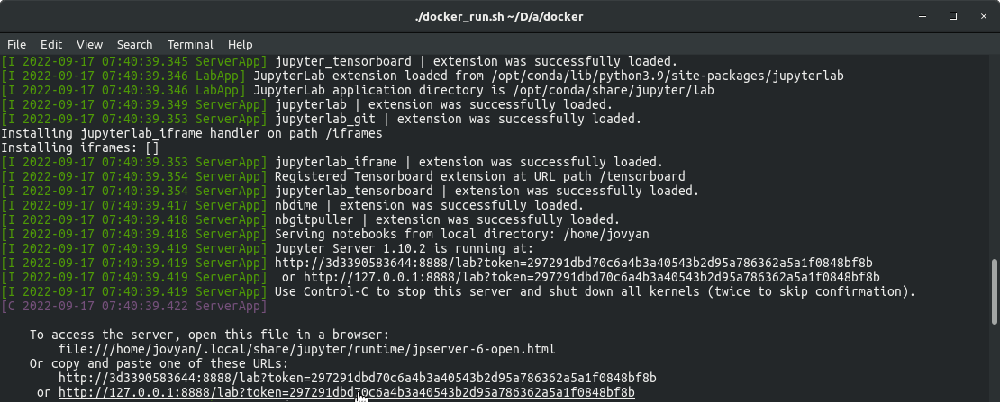

[](https://github.com/ika-rwth-aachen/acdc-notebooks/actions/workflows/build.yml)


# Automated and Connected Driving Challenges (ACDC)

This repository belongs to the **Automated and Connected Driving Challenges (ACDC)**, a Massive Open Online Course (MOOC) on [edX.org](https://www.edx.org/course/automated-and-connected-driving-challenges), teaching how to solve current challenges in the field of automated and connected mobility. This repository contains Jupyter Notebook programming tasks.

Watch the **Course Trailer** for a quick introduction to the course:

[](https://www.youtube.com/watch?v=XR2uBMVX1As)

**Enroll** in the course **for free** [here](https://www.edx.org/course/automated-and-connected-driving-challenges) and learn how to shape future automated and connected mobility!

The course is taught by the [Institute for Automotive Engineering (ika)](https://www.ika.rwth-aachen.de/) of [RWTH Aachen University](https://rwth-aachen.de) in Germany.

## Repository Content

For the complete course content including the solutions to all programming tasks in the course, please enroll in the course. 

If you want to get to know the programming tasks of this repository, you can find an overview in this [Jupyter Notebook](index.ipynb).

We offer additional programming tasks relating to the [Robot Operating System (ROS)]((https://ros.org/)) in the [ACDC repository](https://github.com/ika-rwth-aachen/acdc).

**Note** that Jupyter Notebooks are often not correctly displayed on Github. Use [JuypterLab](https://jupyter.org/) as described below to correctly display the notebooks.

## Quick Start

All programming tasks can be run inside of a Docker container, which we provide. Our ACDC-Notebooks Docker container can be used for starting JupyterLab on you local machine. You can use the following instructions to run the container:

0. Follow all steps described under [Installation](https://github.com/ika-rwth-aachen/acdc/wiki#installations) in the ACDC repository's Wiki.

1. Clone this repository:
    ```bash
    git clone https://github.com/ika-rwth-aachen/acdc-notebooks.git
    ```

2. Pull our ACDC-Notebooks Docker image from our registry:
    ```bash
    docker pull rwthika/acdc-notebooks:latest
    ```

3. In a terminal, navigate to the Docker directory of this repository and launch the ACDC-Notebooks Docker container with the provided run script:
    ```bash
    # acdc-notebooks/docker
    ./run.sh
    ```

    The Docker image should start now and your terminal should display some output similar to the one seen in the image below. Open the last link displayed in *your* terminal and JupyterLab will open in your browser.

    

4. Navigate to the `/acdc/` directory in JupyterLab and open `index.ipynb` to get an overview of all available notebooks.


# License

MIT License

Copyright 2023 Institute for Automotive Engineering of RWTH Aachen University.
